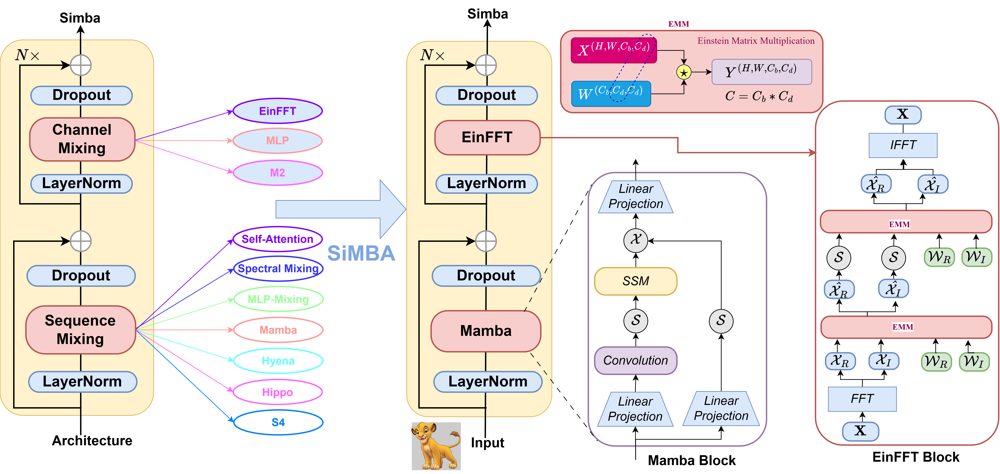

# SiMBA: SiMBA: Simplified Mamba-based Architecture for Vision and Multivariate Time series


## Abstract

'''
Transformers have widely adopted attention networks for sequence mixing and MLPs for channel mixing, playing a pivotal role in achieving breakthroughs across domains. However, recent literature highlights issues with attention networks, including low inductive bias and quadratic complexity concerning input sequence length.  State Space Models (SSMs) like S4 and others (Hippo, Global Convolutions, liquid S4, LRU, Mega, and Mamba), have emerged to address the above issues to help handle longer sequence lengths. 
Mamba, while being the state-of-the-art SSM, has a stability issue when scaled to large networks for computer vision datasets. We propose SiMBA, a new architecture that introduces Einstein FFT (EinFFT) for channel modeling by specific eigenvalue computations and uses the Mamba block for sequence modeling. Extensive performance studies across image and time-series benchmarks demonstrate that SiMBA outperforms existing SSMs, bridging the performance gap with state-of-the-art transformers. Notably, SiMBA establishes itself as the new state-of-the-art SSM on ImageNet and transfer learning benchmarks such as Stanford Car and Flower as well as task learning benchmarks as well as seven time series benchmark datasets.
'''




## Requirement:

```
* PyTorch 1.10.0+
* Python3.8
* CUDA 10.1+
* [timm](https://github.com/rwightman/pytorch-image-models)==0.4.5
* [tlt](https://github.com/zihangJiang/TokenLabeling)==0.1.0
* pyyaml
* apex-amp
```


## Data Preparation

Download and extract ImageNet images from http://image-net.org/. The directory structure should be

```

│ILSVRC2012/
├──train/
│  ├── n01440764
│  │   ├── n01440764_10026.JPEG
│  │   ├── n01440764_10027.JPEG
│  │   ├── ......
│  ├── ......
├──val/
│  ├── n01440764
│  │   ├── ILSVRC2012_val_00000293.JPEG
│  │   ├── ILSVRC2012_val_00002138.JPEG
│  │   ├── ......
│  ├── ......

```


## Train SiMBA small model

```
python3 -m torch.distributed.launch \
   --nproc_per_node=8 \
   --nnodes=1 \
   --node_rank=0 \
   --master_addr="localhost" \
   --master_port=12346 \
   --use_env main.py --config configs/simba/simba_s.py --data-path ../../../../dataset/Image_net/imagenet --epochs 310 --batch-size 128 --drop-path 0.05 --weight-decay 0.05 --lr 1e-3 --num_workers 24\
   --token-label --token-label-size 7 --token-label-data ../../../../dataset/Image_net/imagenet_efficientnet_l2_sz475_top5/
```


## Train SiMBA Base model

```
python3 -m torch.distributed.launch \
   --nproc_per_node=8 \
   --nnodes=1 \
   --node_rank=0 \
   --master_addr="localhost" \
   --master_port=12346 \
   --use_env main.py --config configs/simba/simba_b.py --data-path ../../../../dataset/Image_net/imagenet --epochs 310 --batch-size 128 --drop-path 0.05 --weight-decay 0.05 --lr 1e-3 --num_workers 24\
   --token-label --token-label-size 7 --token-label-data ../../../../dataset/Image_net/imagenet_efficientnet_l2_sz475_top5/
```

## Train SiMBA Large model

```
python3 -m torch.distributed.launch \
   --nproc_per_node=8 \
   --nnodes=1 \
   --node_rank=0 \
   --master_addr="localhost" \
   --master_port=12346 \
   --use_env main.py --config configs/simba/simba_l.py --data-path ../../../../dataset/Image_net/imagenet --epochs 310 --batch-size 128 --drop-path 0.05 --weight-decay 0.05 --lr 1e-3 --num_workers 24\
   --token-label --token-label-size 7 --token-label-data ../../../../dataset/Image_net/imagenet_efficientnet_l2_sz475_top5/
```
